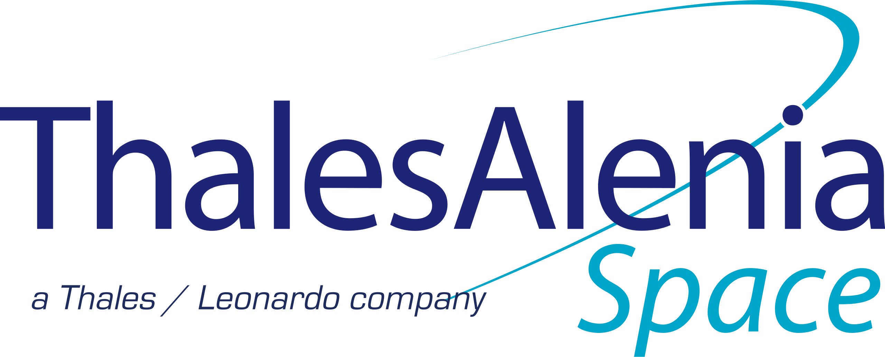
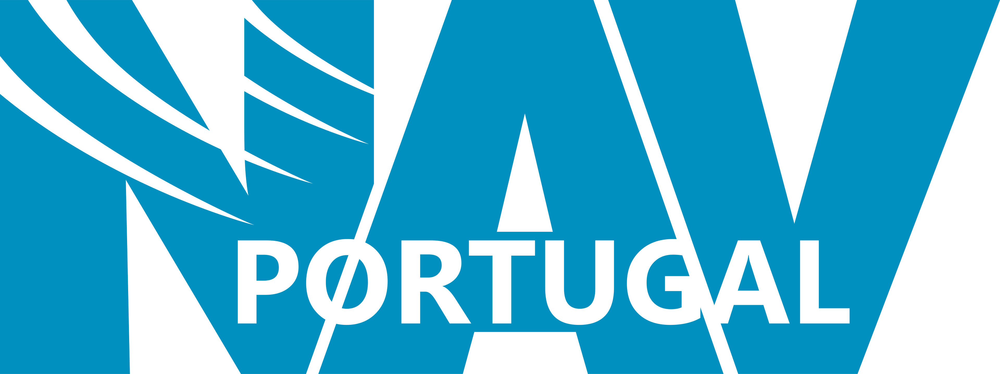
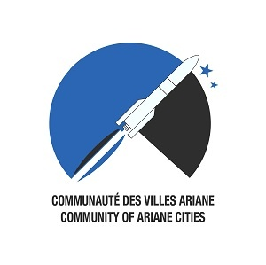
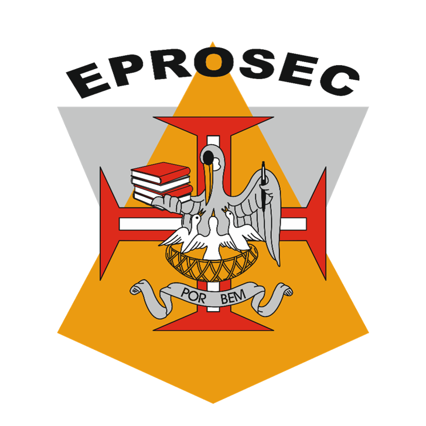
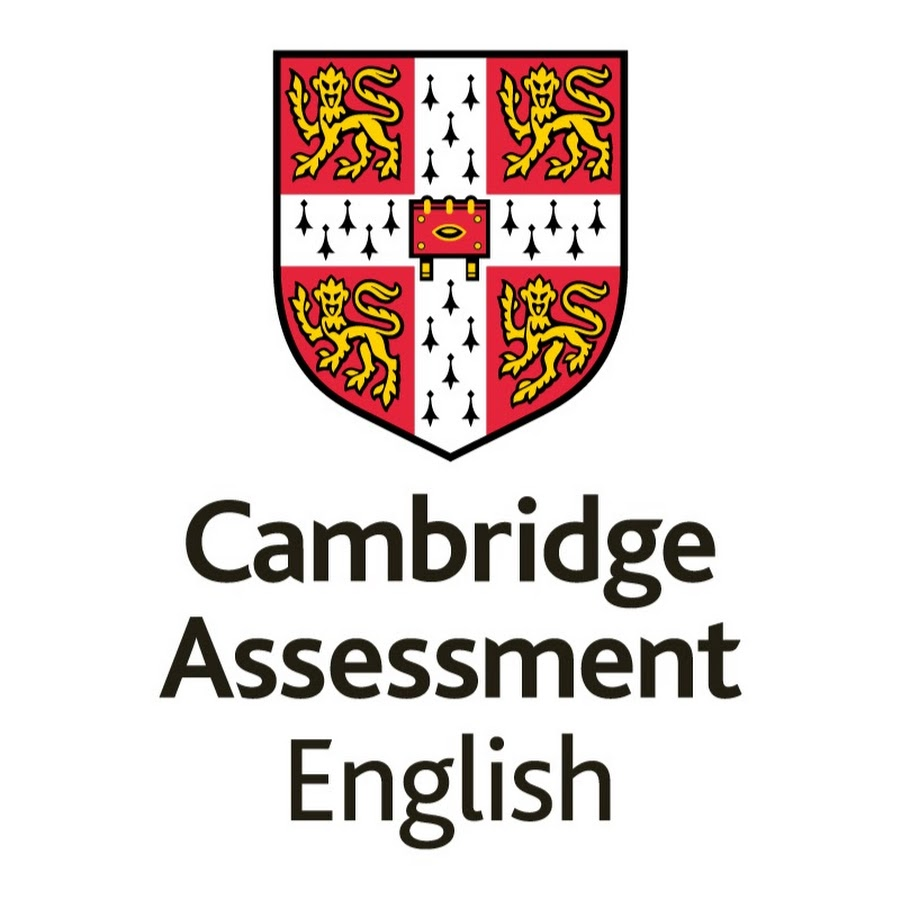
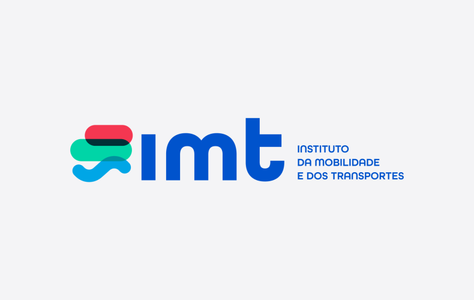
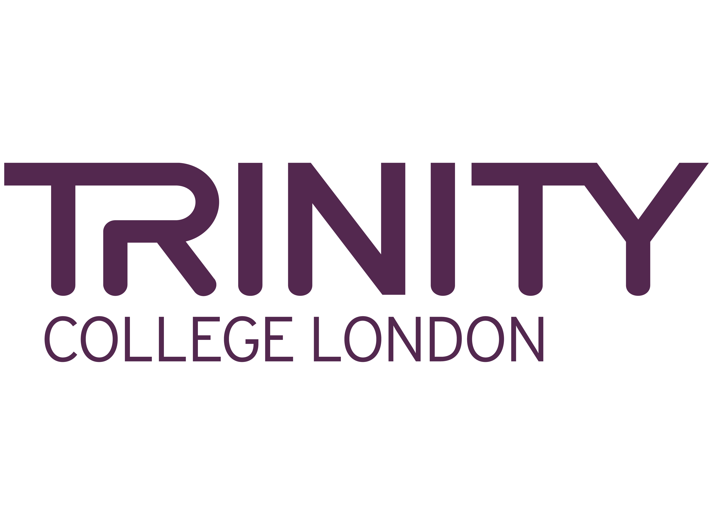
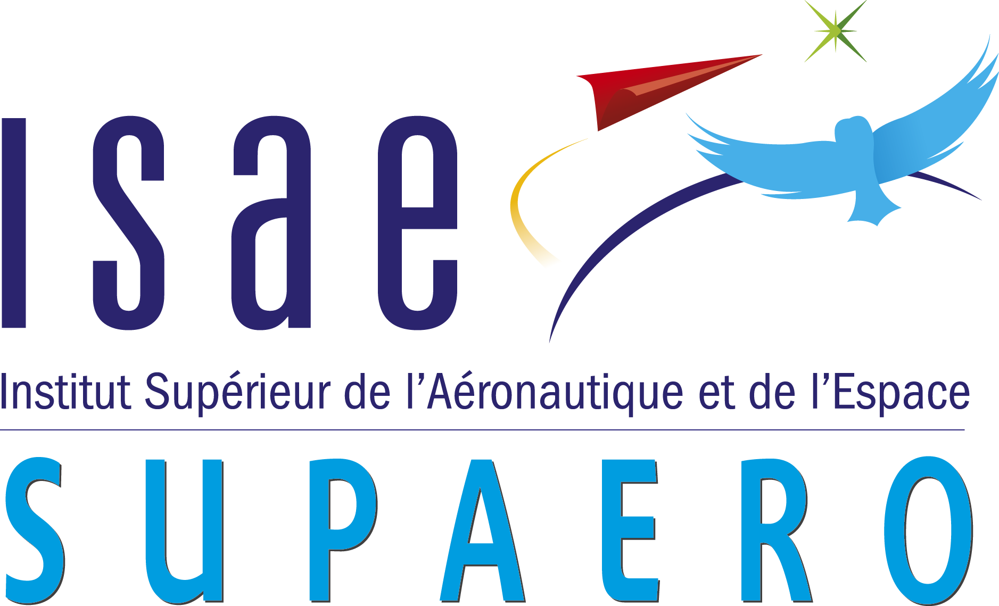
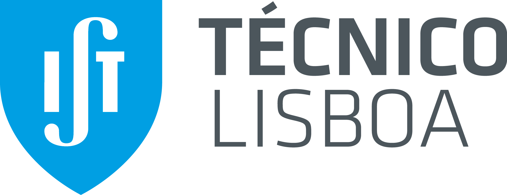

## Experience

<table>
    <thead>
        <tr>
            <th>Company</th>
            <th>Link</th>
            <th>Role</th>
            <th>Dates</th>
            <th>Location</th>
        </tr>
    </thead>
    <tbody>
         <tr>
            <td></td>
            <td><a href="https://www.thalesaleniaspace.com/en" target="_blank">Thales Alenia Space</a></td>
            <td>SBAS Performance and Simulation Engineering Intern</td>
            <td>Apr 2026 - Sep 2026</td>
            <td>Toulouse, France</td>
        </tr>
        <tr>
            <td></td>
            <td><a href="https://www.nav.pt/en" target="_blank">NAV Portugal</a></td>
            <td>CNS/ATM Systems Engineering Intern</td>
            <td>Aug 2024</td>
            <td>Ponta Delgada, Portugal</td>
        </tr>
    </tbody>
</table>

---

## Courses & Training

<table>
    <thead>
        <tr>
            <th>Host</th>
            <th>Link</th>
            <th>Domain</th>
            <th>Dates</th>
            <th>Location</th>
        </tr>
    </thead>
    <tbody>
         <tr>
            <td></td>
            <td><a href="https://www.ariane-cities.org/summer-school/" target="_blank">24th CVA Summer School</a></td>
            <td>Space Transportation Systems</td>
            <td>Jul 2025</td>
            <td>Augsburg, Germany</td>
        </tr>
        <tr>
            <td></td>
            <td><a href="https://www.esa.int/Education/ESA_Academy" target="_blank">ESA Academy's Navigation Training Course 2025</a></td>
            <td>Satellite Navigation</td>
            <td>Jun 2025</td>
            <td>ESEC-Galaxia, Belgium</td>
        </tr>
        <tr>
            <td></td>
            <td><a href="https://www.eprosec.net/" target="_blank">EPROSEC</a></td>
            <td>Professional Training and Personal Development</td>
            <td>Aug 2024</td>
            <td>Ponta Delgada, Portugal</td>
        </tr>
    </tbody>
</table>

---

## Certificates

<table>
    <thead>
        <tr>
            <th>Certifying Authority</th>
            <th>Link</th>
            <th>Domain</th>
            <th>Issue Date</th>
            <th>Location</th>
        </tr>
    </thead>
    <tbody>
        <tr>
            <td></td>
            <td><a href="https://www.cambridgeenglish.org/exams-and-tests/qualifications/proficiency/" target="_blank">Cambridge English</a></td>
            <td>C2 English Proficiency</td>
            <td>Jan 2024</td>
            <td>Lisbon, Portugal</td>
        </tr>
        <tr>
            <td></td>
            <td><a href="https://www.imt-ip.pt/" target="_blank">Instituto da Mobilidade e dos Transportes</a></td>
            <td>Driver's License Category B1 | B</td>
            <td>Aug 2023</td>
            <td>Ponta Delgada, Portugal</td>
        </tr>
    </tbody>
</table>

---

## Additional Activities

<table>
    <thead>
        <tr>
            <th>Host</th>
            <th>Link</th>
            <th>Domain</th>
            <th>Dates</th>
            <th>Location</th>
        </tr>
    </thead>
    <tbody>
        <tr>
            <td></td>
            <td><a href="https://www.trinitycollege.com/" target="_blank">Trinity College London</a></td>
            <td>English Summer Programme</td>
            <td>Jul 2019</td>
            <td>London, United Kingdom</td>
        </tr>
    </tbody>
</table>

---

## Education

<table>
    <thead>
        <tr>
            <th>School</th>
            <th>Link</th>
            <th>Degree</th>
            <th>Dates</th>
        </tr>
    </thead>
    <tbody>
        <tr>
            <td></td>
            <td><a href="https://www.isae-supaero.fr/en/" target="_blank">Institut Supérieur de l'Aéronautique et de l'Espace (ISAE-SUPAERO)</a></td>
            <td>MSc of Science in Aerospace Engineering</td>
            <td> Sep 2024 - Dec 2026</td>
            <td>Toulouse, France</td>
        </tr>
        <tr>
            <td></td>
            <td><a href="https://tecnico.ulisboa.pt/en/" target="_blank">Instituto Superior Técnico (Universidade de Lisboa)</a></td>
            <td>BSc of Science in Aerospace Engineering</td>
            <td>Oct 2021 - Jul 2024</td>
            <td>Lisbon, Portugal</td>
        </tr>
    </tbody>
</table>

---

## Expired Certificates

<table>
    <thead>
        <tr>
            <th>Certifying Authority</th>
            <th>Link</th>
            <th>Domain</th>
            <th>Issue Date</th>
            <th>Location</th>
        </tr>
    </thead>
    <tbody>
        <tr>
            <td></td>
            <td><a href="https://www.cambridgeenglish.org/exams-and-tests/qualifications/first/" target="_blank">Cambridge English</a></td>
            <td>B2 English Proficiency</td>
            <td>Sep 2020</td>
            <td>Ponta Delgada, Portugal</td>
        </tr>
    </tbody>
</table>
